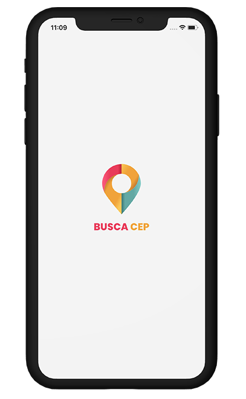
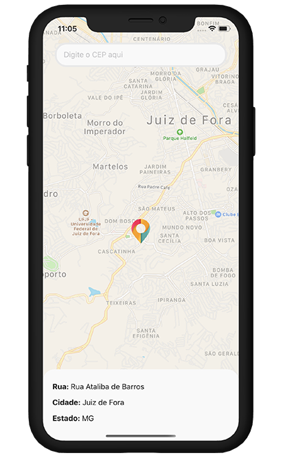

[](https://github.com/mateuslouback/AppBuscaCEP/stargazers)
[](https://github.com/mateuslouback/AppBuscaCEP/issues)
[](https://github.com/mateuslouback/AppBuscaCEP/network)

<br />
<p align="center">
  


  <h2 align="center">App Busca CEP</h2>

  <p align="center">
    <strong>Sample application that seeks details of zip codes in Brazil.</strong>
    <br />
  </p>


## Contents

* [About the Project](#about-the-project)
  * [Built With](#built-with)
* [Getting Started](#getting-started)
  * [Installation](#installation)
* [Screenshots](#screenshots)
* [Contact](#contact)


## About The Project

<p align="center">
  
</p>

This is a simple CEP search project in Brazil.
The project was made for the IOS and Android platforms through React Native with Expo.
<br />
<br />


### Built With

* [React-Native](https://github.com/facebook/react-native)
* [Expo](https://expo.io)
* [React Native Maps](https://github.com/react-native-community/react-native-maps)


## Getting Started

To get a local copy up and running follow these simple steps.


### Installation

1. Create account in [CEP Aberto](https://www.cepaberto.com) to obtain the access Token.

2. Instal [Expo CLI](https://expo.io/learn)
```sh
npm install expo-cli --global
```
3. Clone the repo
```sh
git clone https://github.com/mateuslouback/AppBuscaCEP.git
```
4. Install packages
```sh
yarn install
```
5. Place the obtained token API in the place indicated below:
```sh
src/Pages/Main/index.js in the code snippet (Authorization: "Token token=YOURTOKEN")
```
6. Run project on IOS or Android
```sh
yarn start
```
7. Read the QRCode with your phone's camera

## Screenshots

<p align="center">
  
  
</p>


## Contact

[Mateus Louback](https://mateuslouback.github.io) - [LinkedIn](https://www.linkedin.com/in/mateuslouback/)
